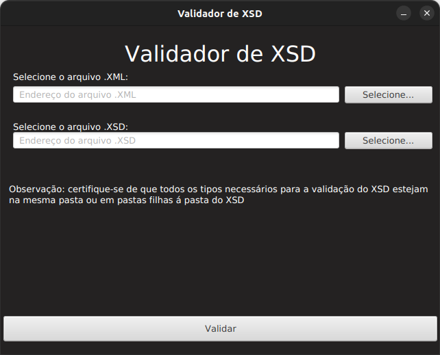
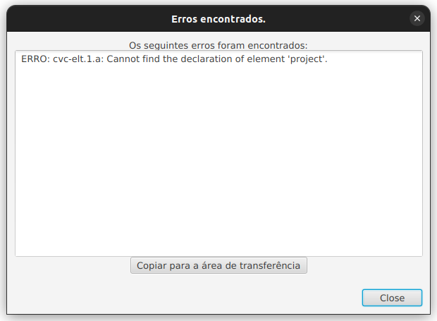

# Validador de XSD
Validador de XSD feito em JavaFX. Para utilizar, basta inserir o endereço do XML e do XSD nos campos e clicar em validar:

Caso algum erro ocorra, a seguinte janela de erros irá aparecer:
